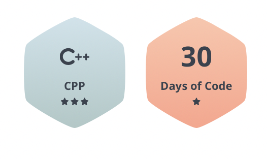

## Hi there, I'm Sandeepan👋

- 👨‍🏫 I have worked as a Web Dev Intern for Let's Grow More and The Sparks Foundation    
- 🔭 Open-source contributor for GWOC'21 [Here](https://www.linkedin.com/posts/activity-6829694955611594752-U2He)
- 🌱 I’m currently learning Machine learning and Competitive Programming.
- 🥅 Goals: Contribute more to Open Source projects
- ⚡ Fun fact: I love to play badminton and basketball
- 👯 I’m looking to collaborate on Basic ML Projects

## :rainbow: Hey Profile Visitor :eyes:

 

  

## Want to connect? My inbox is always open! 📫

  &nbsp;&nbsp;&nbsp;&nbsp;
  &nbsp;&nbsp;&nbsp;&nbsp;
  &nbsp;&nbsp;&nbsp;&nbsp;
  &nbsp;&nbsp;&nbsp;
  &nbsp;&nbsp;&nbsp;

 

### :sparkles: One line that describes me best?

I am a self taught developer, trying to dive deep in the ocean of web world and Competitive programming.

### 🤔 What do I do? 

 - :green_book: I am a 2nd year CSE Sophomore, with a great interest in ML.
 - :green_book: Building projects in Webdev and ML.
 - :green_book: Looking for interesting opportunities in Software Engineering.

## Languages and Tools ⚙

     </a>            <a>  

### 🌱 What I’m currently learning?

Recently, I am much involved in the "Competitive programming","Opensource","ML".

### What are my featured projects:question::rocket:
<code>[ Payment Gateway ](https://csesandeepan39.github.io/The-sparks-foundation-web-dev/)</code> 💬   
<code>[Architecture](https://csesandeepan39.github.io/LGM-VIP-1/)</code>🏛    

### Earned Badges

### 📶 Stats:
<!--  -->

&nbsp;

[linkedin]: https://www.linkedin.com/in/sandeepan-mohanty-979908204?lipi=urn%3Ali%3Apage%3Ad_flagship3_profile_view_base_contact_details%3Bo6ONfl5uTpupDW5q%2BfWvzw%3D%3D

